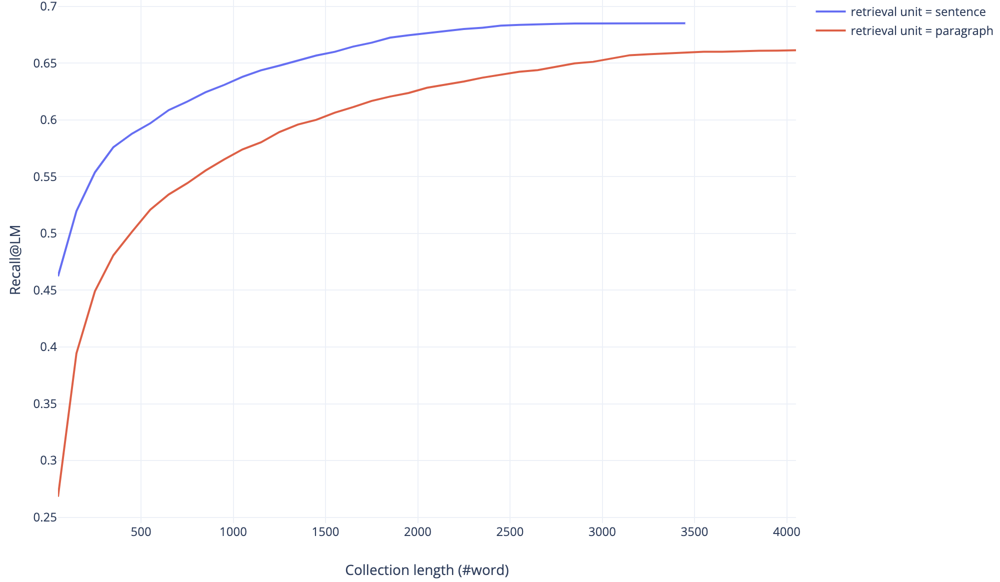

## Compress retrieved collection with DensePhrase
This repository is used for compressing retrieved collection which further is used as a prompt for retrieval augmented language model.

### Procedure
#### step 1. Clone repository and update submodules
```bash
git clone --recurse-submodules https://github.com/nota-github/retrieved_collection_compression_BOOSTCAMP.git
cd retrieved_collection_compression_densephrase
```

#### step 2. Setup docker environment
```bash
# in host
docker pull notadockerhub/collection_compression_densephrase:latest
docker run -v /path/to/parent_of_repository:/root --workdir /root --name {container_name} --shm-size=2gb -it --gpus GPU_INDICES -t notadockerhub/collection_compression_densephrase

# in container
cd retrieved_collection_compression_BOOSTCAMP/DensePhrases
sed -i s/"torch==1.9.0"/"torch>=1.9.0"/g requirements.txt # allow recent version of pytorch
pip install -e . # editable mode install
```

#### step 3. Setup path & variable
```bash
cd /root/retrieved_collection_compression_BOOSTCAMP
./config.sh
source ~/.bashrc
```

#### step 4. Download resources: data, index, wiki
```bash
./download.sh 
# download `data`, `index`, `wiki` with this script
# for `index`, download both 'small' and 'full' version
cd ../
```
* data: preprocessed datasets
  * this project will use open-domain QA (`open-qa`) only
* index: pre-built index of wikipedia
  * we will not re-train passage encoder
* wiki: pre-processed raw data for making index
* pre-trained `query encoder` will be automatically downloaded from [huggingface modelhub](https://huggingface.co/princeton-nlp/densephrases-multi)

#### step 5. Retrieve relevant sentences with varying #retrieve 
* fixed setting
  * retrieval unit: sentence
    * other retrieval granularity (documents, paragraph, phrase) not allowed
  * topK = 200
  * test query, collection
```bash
python retrieve.py \
  --batch_size BATCH_SIZE \
  --query_encoder_name_or_dir princeton-nlp/densephrases-multi \
  --index_name INDEX_NAME \
  --runfile_name run.tsv
```
* batch_size=128 works for GPU with VRAM=24GB
* INDEX_NAME
  * small: 1048576_flat_OPQ96_small -> use it for development phase
  * full: 1048576_flat_OPQ96 -> use it before finalize solution
* output: runfile
* assignment: modify inference logic to improve evaluation metric (mAR)
  * modifyable parts
    * Densephrases/densenphrases/index.py > search_dense(), search_phrase()
  * prefer short sentences with minimal redundancy
<details>
  <summary>retrieved sentences example</summary>
Query: Where are mucosal associated lymphoid tissues present in the human body and why?
(인체에서 점막 관련 림프 조직은 어디에 존재하며 그 이유는 무엇입니까?)
</br>
Answers: [oral passage, salivary glands, gastrointestinal tract, breast, skin, thyroid, lung, nasopharyngeal tract, eye]
 
Retrieved "sentences" by DensePhrase: ['In the gastrointestinal tract, the term "mucosa" or "mucous membrane" refers to the combination of epithelium, lamina propria, and (where it occurs) muscularis mucosae.', 'Another type of relatively undifferentiated connective tissue is mucous connective tissue, found inside the umbilical cord.', 'Lymph nodes or "glands" or "nodes" or "lymphoid tissue" are nodular bodies located throughout the body but clustering in certain areas such as the armpit, back of the neck and the groin.', 'The mucosa-associated lymphoid tissue (MALT), also called mucosa-associated lymphatic tissue, is a diffuse system of small concentrations of lymphoid tissue found in various submucosal membrane sites of the body, such as the gastrointestinal tract, oral passage, nasopharyngeal tract, thyroid, breast, lung, salivary glands, eye, and skin.' ...]
</details>

#### step 6. Calculate mean average recall (mAR)
```bash
python eval.py --runfile_name run.tsv
```
* output: mAR
* baseline result
  * retrieval_unit = sentence: mAR = 60.71 (starts from this baseline)
  * retrieval_unit = paragraph: mAR = 55.86
  * 

#### step 7. Query-side fine-tuning
```bash
make train-query MODEL_NAME=NEW_MODEL_SAVE_DIR DUMP_DIR=$SAVE_DIR/densephrases-multi_wiki-20181220/dump/ LOAD_DIR_OR_PRETRAINED_HF_NAME=princeton-nlp/densephrases-multi
```
* assignment: adapt Densephrases to retrieval unit similar to sentence
  * modifyable parts
    * Densephrases/train_query.py > get_top_phrase(), annotate_phrase_vecs()
    * Densephrases/densephrases/encoder.py > train_query()

#### (optional) step 8. Retrieval-augmented Language Model
* After optimize your retriever, you can feed retrieved collection into generative language model (GLM).
* Below command will launch `gradio` based web demo for GLM chatbot augmented with densephrase retriever.
```bash
export OPENAI_API_KEY=YOUR_API_KEY; python run_ralm.py --index_name INDEX_NAME
```
* index_path: $SAVE_DIR/densephrases-multi_wiki-20181220/dump/$INDEX_NAME
  * INDEX_NAME default: start/1048576_flat_OPQ96_small
* GLM API
  * default: `gpt-3.5-turbo-16k-0613` of OpenAI
  * HyperClova studio
<details>
  <summary> generated answer example</summary>
Query: Where are mucosal associated lymphoid tissues present in the human body and why?
(인체에서 점막 관련 림프 조직은 어디에 존재하며 그 이유는 무엇입니까?)
</br>
</br>
Generated answer: Mucosal-associated lymphoid tissues (MALT) are found in various submucosal membrane sites of the body, including the gastrointestinal tract, oral passage, nasopharyngeal tract, thyroid, breast, lung, salivary glands, eye, and skin. They are present in these locations because they play a crucial role in the immune system's defense against pathogens that may enter the body through these mucosal surfaces. MALT acts as a barrier and initiates immune responses to protect against infections in these areas. Additionally, the presence of MALT in the gut is particularly important due to the large mass of lymphoid tissue in the intestine, which helps in the absorption of nutrients and provides immune protection against ingested pathogens.
</br>
</br>
Appended context with 88 sentences: [Document(page_content='In the gastrointestinal tract, the term "mucosa" or "mucous membrane" refers to the combination of epithelium, lamina propria, and (where it occurs) muscularis mucosae.', metadata={'source': 'source_0'}), Document(page_content='Lymph nodes or \'glands\' or "nodes" or "lymphoid tissue" are nodular bodies located throughout the body but clustering in certain areas such as the armpit, back of the neck and the groin.', metadata={'source': 'source_1'}), …, Document(page_content='Alkaline mucus exists in the human eye, stomach, saliva, and cervix. In the stomach, alkaline mucus is secreted by gastric glands in the mucosa layer of the stomach wall.', metadata={'source': 'source_87'})]
</br>
</br>
Used sources to generate answer: ['source_7', 'source_33', 'source_36']
</br>
</br>
source_7: The mucosa-associated lymphoid tissue (MALT), also called mucosa-associated lymphatic tissue, is a diffuse system of small concentrations of lymphoid tissue found in various submucosal membrane sites of the body, such as the gastrointestinal tract, oral passage, nasopharyngeal tract, thyroid, breast, lung, salivary glands, eye, and skin.
</br>
source_33: In fact, the intestine possesses the largest mass of lymphoid tissue in the human body.
</br>
source_36: Gut-associated lymphoid tissue (GALT) is a component of the mucosa-associated lymphoid tissue (MALT) which works in the immune system to protect the body from invasion in the gut.
</details>

* 

### Acknowledgement
* Majority of retrieval code comes from [princeton-nlp/Densephrases](https://github.com/princeton-nlp/DensePhrases) and included as [submodule](Densephrases) of this repository.
* Retrieval-augmented LM is built based on [langchain](https://github.com/hwchase17/langchain).